<div align="center">


# db-agent

<p>
  <a href="README.md"></a>
  <a href="README.en.md"></a>
</p>

### Natural-language database analytics harness

Ask in plain language, query SQLite / HBase / Hive — with permissions, self-healing, and evaluation.
**Agent = Model + Harness.** This repo builds the latter.

[](https://github.com/TisseurdOr/db-agent/actions/workflows/test.yml)
[](https://www.python.org)
[](https://github.com/langchain-ai/langgraph)
[](https://www.deepseek.com)
[](https://fastapi.tiangolo.com)
[](https://github.com/TisseurdOr/db-agent/stargazers)

[Features](#1-features-what-it-does) · [Architecture](#2-architecture-how-it-is-split) · [Lifecycle](#3-lifecycle-how-one-query-runs) · [Evolution](#4-evolution-how-it-grew) · [Quick start](#quick-start) · [API](docs/新手手册/API.md)

</div>

---

This is not a toy that “lets a model write SQL.” It is an engineering system that **lets a model write SQL without going wrong**: real tool execution, hard permission checks, recoverable failures, and evaluable results. Swap DeepSeek / Claude by changing the API — the harness stays. See [`HARNESS.md`](HARNESS.md).

> **Scope**: Engineering mechanisms follow a production mindset (permissions / HITL / self-healing / observability / swappable backends), and the project is deployed live.
> SQLite is a real local DB; **HBase / Hive are in-memory simulators** (API-aligned, no real cluster) — swap in a real connector when needed.
> All tests run offline: LLM / Embedding are scripted fakes in tests (`pytest tests/` stays green — currently **531** cases).
> Web can demo the full path: optional `WEB_API_TOKEN` auth; sessions default to memory, or Redis when `REDIS_URL` is set.
> Vector store supports ChromaDB / Milvus (`VECTOR_DB` switch); Redis / Milvus are “optional backends + auto fallback.”

---

## 1. Features: what it does

The pain is concrete: three dialects (SQL / Hive / HBase), schema changes wait on the data team, and most Text-to-SQL tools only generate SQL — no execution, no auth, no repair. This project does **plain language → query → analysis**, with permissions, reliability, and evaluation included.

<p align="center">
  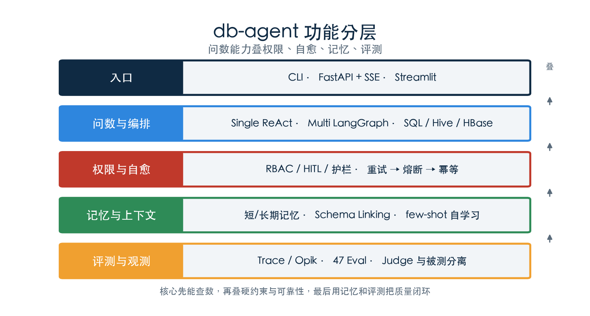
</p>
<p align="center"><sub>Fig. 1 · Functional layers: Q&A plus permissions, self-healing, memory, eval</sub></p>

| Capability | What it does | Where |
|------|--------|----------|
| **Multi-engine Q&A** | Natural language over SQLite / simulated HBase / Hive | `harness/tools/` + 6 specialist agents |
| **Dual orchestration** | Single: handwritten ReAct; Multi: LangGraph 10 nodes | `orchestration/single` · `orchestration/multi` |
| **Determinism first** | Metric templates; Router hard rules → LRU → LLM | `template_matcher` · `router.py` |
| **Permissions & HITL** | 5-role RBAC (tool/table/row) + approval for sensitive cols / writes | `entitlement.py` · `interrupt()` |
| **Three guardrails** | Injection check → SELECT-only → output PII filter | `guardrails.py` |
| **Self-healing** | API retry → SQL repair → replan → circuit / idempotency / alerts | `retry` · `circuit_breaker` · `idempotency` |
| **Memory & learning** | Short/long memory + HyDE + LLM rerank + Schema Linking + successful SQL → few-shot | `memory/` · `long_term_memory.py` · `sql_examples.py` |
| **Obs & eval** | Trace JSONL + Opik; 47 eval cases (Kimi Judge / DeepSeek under test) | `observation/` · `tests/eval_*` |
| **Three entrypoints** | CLI `db-agent` · Streamlit · FastAPI + React SSE | `main.py` · `app.py` · `server/` |

**What one question looks like:**

```
User      ❯ Which department has the highest sales?

db-agent  ❯ Router → sql
            template miss → discover_relevant_schema → run_query
            SELECT d.name, SUM(o.amount) ...
            Marketing  ¥ 1,284,300

User      ❯ Show salary distribution for Marketing

db-agent  ❯ Entitlement: analyst may query salary
            HITL interrupt() → wait for y/n
            After approve: distribution + write sql_examples for next few-shot
```

---

## 2. Architecture: how it is split

Design line: **determinism first** — templates > LLM, regex > LLM, hard rules > soft semantics. Runtime lives in `harness/`, split into six dimensions:

| Dimension | Path | Role |
|------|------|------|
| Context | `harness/context/` | Prompt assembly, Schema Linking, few-shot, SQL templates, token/window compression |
| Memory | `harness/memory/` | Short/long memory, controller, learning loop; Chroma / Milvus |
| Tools | `harness/tools/` | schema / query / analysis / chart / hbase / hive / knowledge |
| Orchestration | `harness/orchestration/` | `single/` ReAct; `multi/` LangGraph 6 agents + Router |
| Observation | `harness/observation/` | Trace, Opik, cost, alerts, ops metrics |
| Constraints | `harness/constraints/` | RBAC, guardrails, confidence/HITL, retry, circuit breaker, idempotency |

<p align="center">
  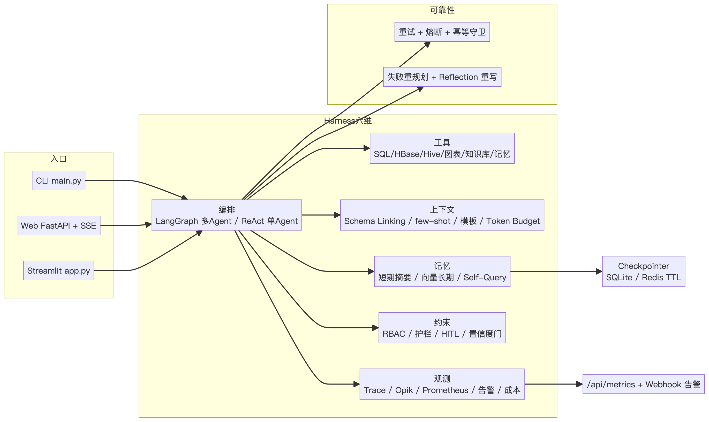
</p>
<p align="center"><sub>Fig. 2 · Mechanism overview: entry → six harness dims → reliability cross-cuts</sub></p>

<p align="center">
  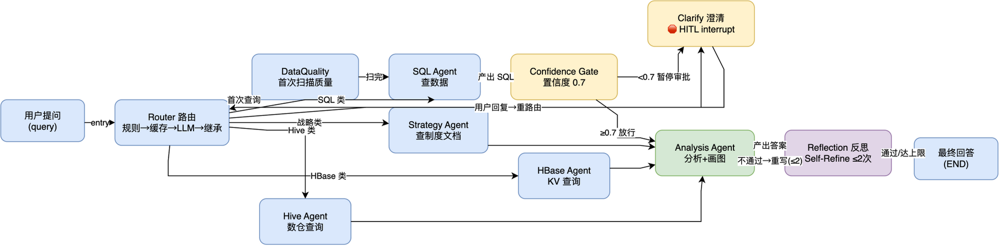
</p>
<p align="center"><sub>Fig. 3 · Multi orchestration: Router → specialist agents → Analysis / Reflection</sub></p>

<details>
<summary>Six-dimension detail diagrams (expand)</summary>

<p align="center">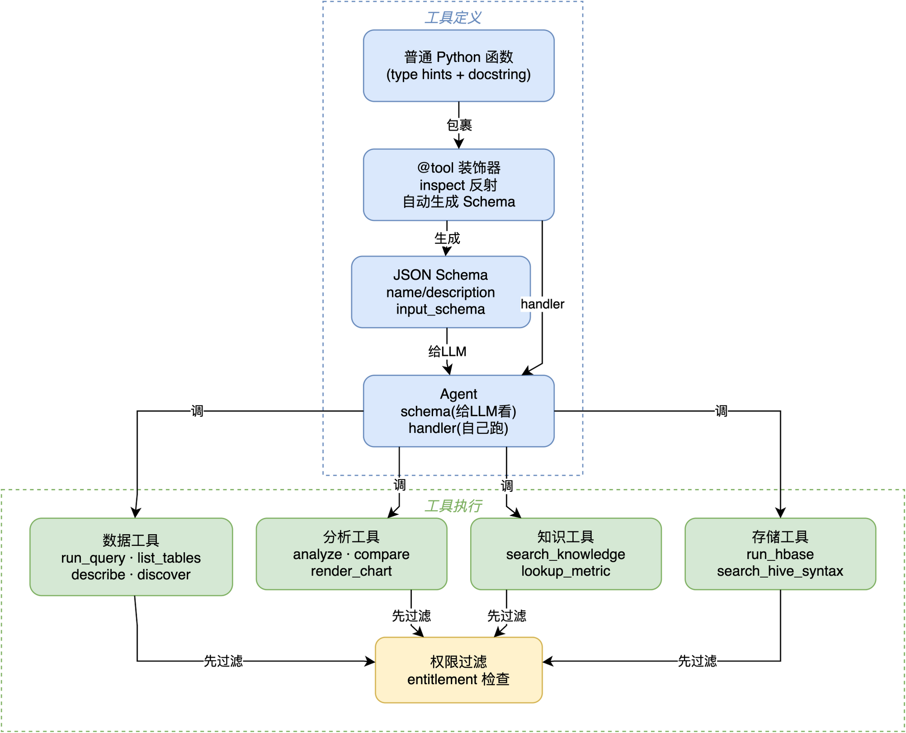</p>
<p align="center"><sub>Tools</sub></p>

<p align="center">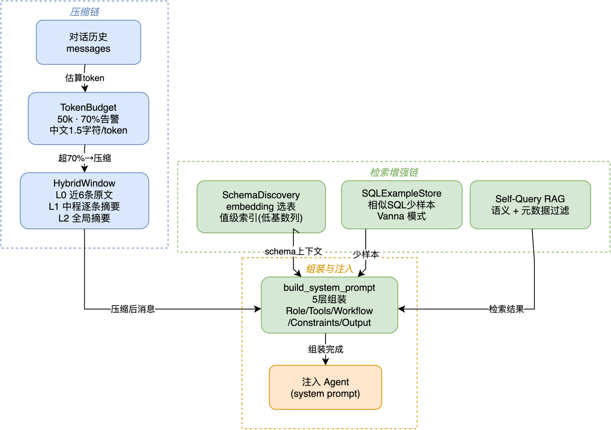</p>
<p align="center"><sub>Context</sub></p>

<p align="center">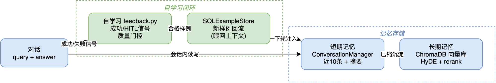</p>
<p align="center"><sub>Memory</sub></p>

<p align="center">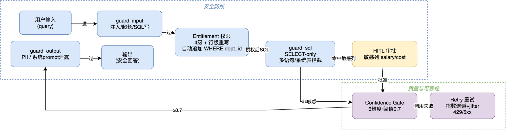</p>
<p align="center"><sub>Constraints & permissions</sub></p>

<p align="center">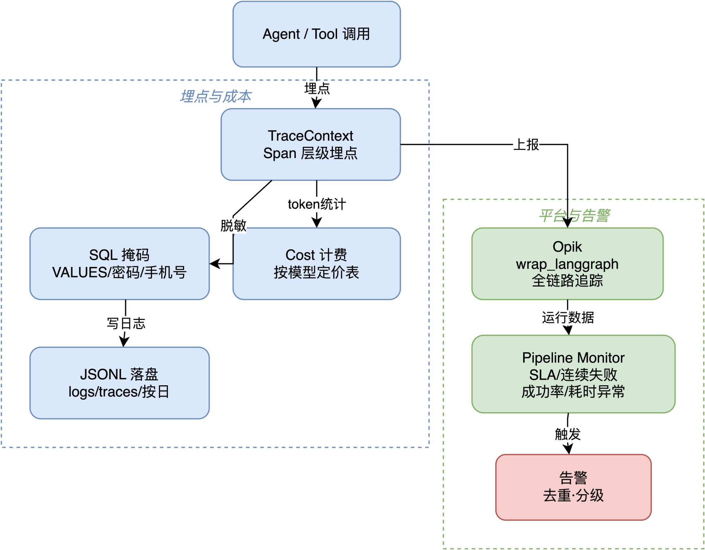</p>
<p align="center"><sub>Observability & eval</sub></p>

</details>

```text
Entrypoints
  ├─ CLI        main.py / db-agent --mode single|multi
  ├─ Streamlit  uv run streamlit run app.py
  └─ Web        uvicorn server.main:app + frontend (Vite)
                    │
                    ▼
              MultiAgentRunner (LangGraph)
                ├─ Router (hard rules + context inherit + LRU + LLM)
                ├─ sql / strategy / hbase / hive / data_quality
                │     └─ sql failure can replan via Router (≤1)
                ├─ confidence_gate / clarify (optional HITL)
                └─ analysis → reflection (≤2) → final_answer
```

**6 specialist agents** (isolated tool traces; receive task, return result):

| Agent | Role | Typical tools |
|-------|------|----------|
| SQL | Query only | `discover_relevant_schema` / `run_query` |
| Analysis | Analyze only, no SQL | `analyze_results` / `render_chart` |
| Strategy | Policy / metric definitions | `search_knowledge_base` / `lookup_metric` |
| HBase | KV ops (writes need HITL) | `run_hbase` |
| Hive | Warehouse dialect (local sim) | `run_query` + grammar templates |
| DataQuality | Optional quality scan | row count / NULL / date continuity |

Learning notes, resume materials, and old experiments live under `sidecar/` and are not on the runtime path. Deeper notes: [`HARNESS.md`](HARNESS.md) · [`docs/项目介绍/engineering-mechanisms.md`](docs/项目介绍/engineering-mechanisms.md).

---

## 3. Lifecycle: how one query runs

From entry to persistence, a Multi-mode NL query roughly follows:

<p align="center">
  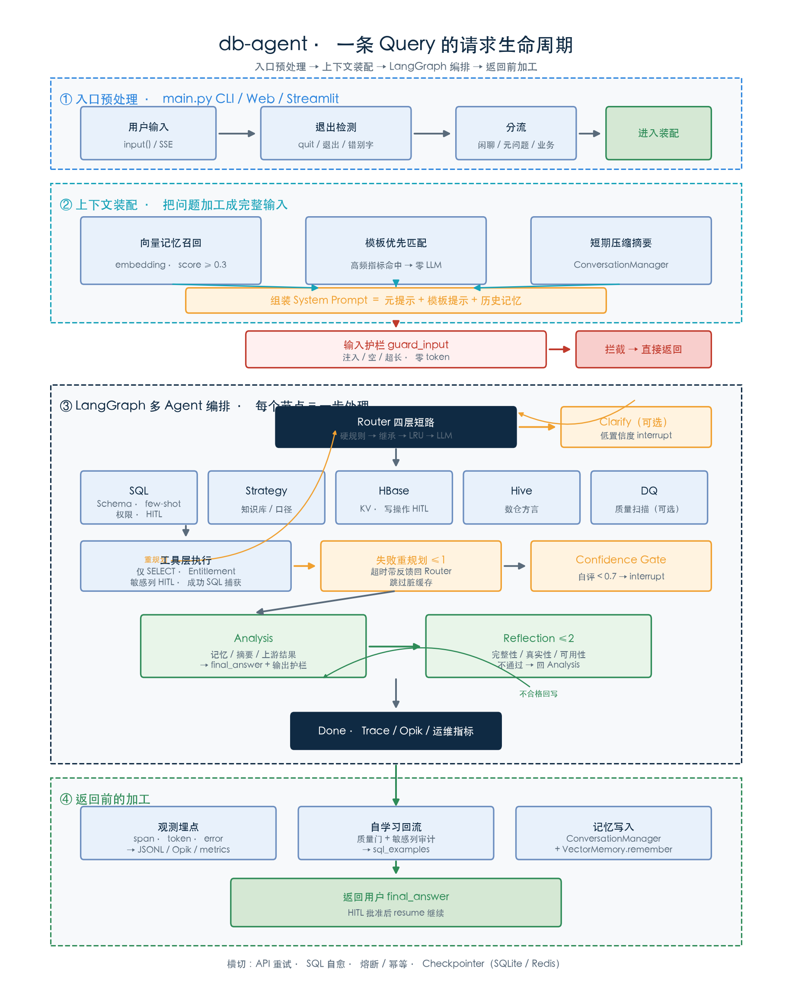
</p>
<p align="center"><sub>Fig. 4 · Request lifecycle (entry → persist)</sub></p>

```text
Entrypoint preprocess
  → guard_input (injection / empty / too long, zero token)
  → memory recall (HyDE + LLM rerank) + (optional) template match
  → Router: hard rules > context inherit > LRU > LLM
       ├─ confidence=low → clarify (interrupt)
       └─ plan → Task board; optional data_quality
  → specialist agent (sql / hbase / hive / strategy …)
       · Schema Linking + few-shot
       · run_query: SELECT-only → Entitlement → sensitive-col HITL
       · capture successful SQL (for learning)
       · timeout → replan via Router with feedback (≤1)
  → confidence_gate (self-score < 0.7 → interrupt)
  → Analysis → Reflection (retry ≤2 on fail)
  → guard_output (PII)
  → Trace JSONL + Opik + ops metrics
  → short/long memory write; Web SSE done
```

<p align="center">
  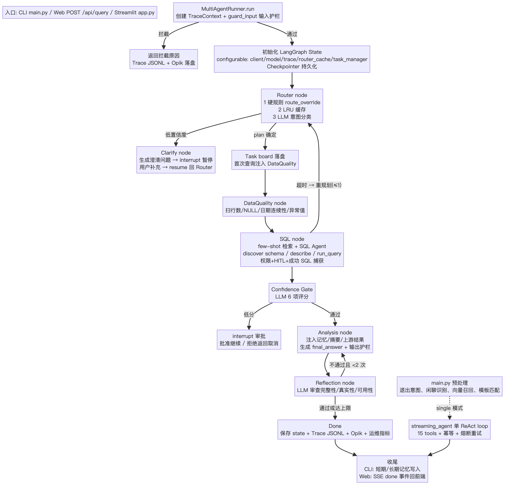
</p>
<p align="center"><sub>Fig. 5 · Query flow detail</sub></p>

**Cross-cutting (not separate nodes, but always on):**

| Layer | Behavior |
|----|------|
| API retry | 429 / 5xx / timeout → exponential backoff + jitter |
| SQL self-heal | error feedback → check schema → rewrite (~2 times) |
| Circuit breaker | consecutive failures → fail fast; half-open after cool-down |
| Tool idempotency | same write args within TTL are not re-executed |
| Observability | local JSONL audit + Opik tree; optional webhook alerts |

**Security chain:**

<p align="center">
  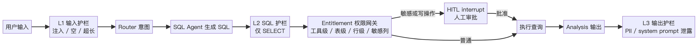
</p>
<p align="center"><sub>Fig. 6 · Input guard → RBAC → HITL → output guard</sub></p>

**Self-healing:**

<p align="center">
  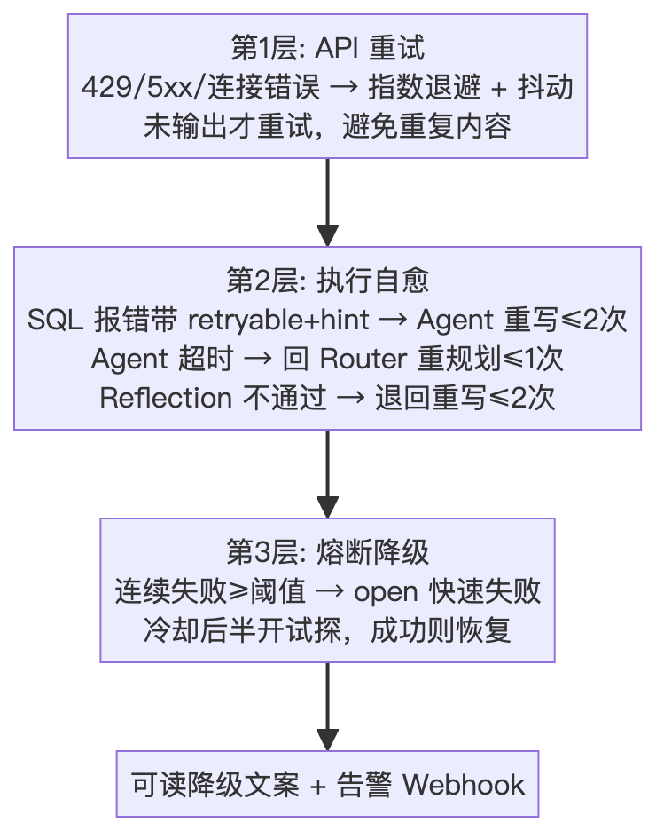
</p>
<p align="center"><sub>Fig. 7 · Retry → SQL heal / replan → circuit breaker</sub></p>

**Memory / obs loop:**

<p align="center">
  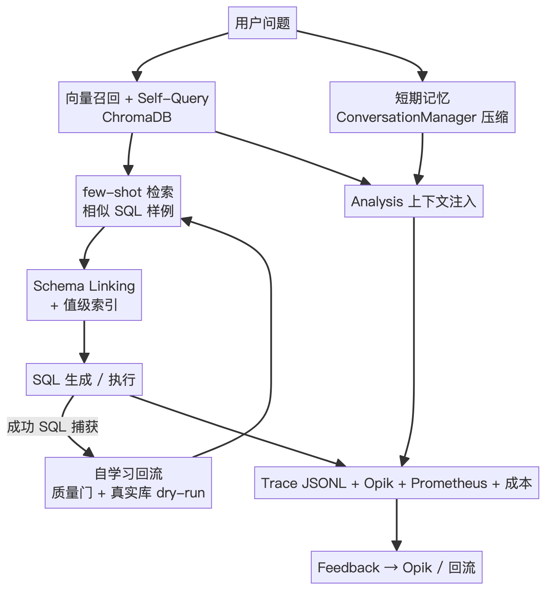
</p>
<p align="center"><sub>Fig. 8 · Recall → execute → learning → Trace / Opik</sub></p>

Single-mode differences: no Router / DQ / Confidence Gate / Analysis / Reflection — entry goes straight into a ReAct loop (~15 tools). HITL becomes a “needs approval” flag, without native interrupt pause/resume.

---

## 4. Evolution: how it grew

**Each layer was forced by a real problem — not feature stacking.**

<p align="center">
  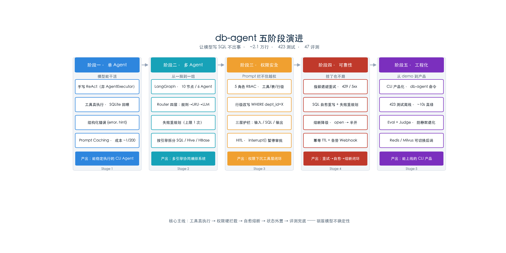
</p>
<p align="center"><sub>Fig. 9 · Five stages: Single → Multi → Security → Reliability → Productization</sub></p>

| Stage | Core problem | Key moves | Output |
|------|----------|----------|------|
| **1 · Single Agent** | Make the model do real work | Handwritten ReAct (no AgentExecutor); real tools; structured errors; prompt caching | Stable CLI agent |
| **2 · Multi Agent** | Multi-engine coordination | LangGraph 10 nodes / 6 agents; Router 4-layer short-circuit; failure replan | Multi-engine orchestration |
| **3 · Security** | Prompts cannot stop privilege abuse | 5-role RBAC; row-level WHERE rewrite; three guardrails; HITL `interrupt()` | Permissions at the tool layer |
| **4 · Reliability** | Survive hangs without burning money | Retry → SQL heal → replan → **circuit / idempotency / alerts**; SSE disconnect handling | Reliability loop |
| **5 · Productization** | Demo → product | `db-agent` CLI; 531 offline tests; 47 evals + Golden Set; Redis / Milvus switch; quality gates | Demoable, CI-ready shape |


### Design choices (why)

- **No AgentExecutor**: master a handwritten loop first, then use LangGraph as an explicit state graph.
- **`run_query` is SELECT-only**: writes are blocked at the tool layer.
- **HBase / Hive simulators**: API-aligned and replaceable; the POC proves orchestration, not a fake cluster.
- **HITL via native `interrupt()`**: pause points land in the checkpointer; `Command(resume=...)` continues.
- **Judge ≠ model under test**: Eval uses Kimi; the system under test uses DeepSeek.
- **Learning captures successful `run_query` SQL**: not free-form model prose; sensitive columns are excluded.
- **Circuit / idempotency**: retries on consecutive failures burn tokens; retries/replans can run write tools twice — both layers were added after real pain.

---

## Where to start reading

Follow the runtime path, not a folder sweep:

| Priority | Path | What to look for |
|--------|------|--------|
| 1 | `main.py` | CLI: `--mode` / `--user`, memory inject, HITL |
| 1 | `server/main.py` + `frontend/` | Web: FastAPI + SSE + React |
| 2 | `harness/orchestration/single/agent.py` | single: ReAct loop |
| 2 | `harness/orchestration/multi/` | multi: graph / runner / nodes / router |
| 3 | `harness/tools/` · `harness/constraints/entitlement.py` | capabilities & permissions |
| 4 | `harness/memory/` · `harness/context/` | memory, few-shot, Schema Linking |
| 5 | `HARNESS.md` · `tests/` · `docs/操作与排障/troubleshooting.md` · `docs/新手手册/用户手册.md` | architecture, eval, debug, onboarding |

---

## Quick start

```bash
git clone https://github.com/TisseurdOr/db-agent.git
cd db-agent
uv sync && source .venv/bin/activate        # install + create db-agent command
cp .env.example .env                        # at least set ANTHROPIC_API_KEY
db-agent --mode multi                       # CLI (same as python main.py --mode multi)
```

> Missing keys get a friendly prompt (`cp .env.example .env`), not a traceback.

```bash
db-agent                                   # single (default)
db-agent --mode multi
db-agent --mode multi --user analyst       # can query salary → HITL
db-agent --mode multi --user viewer        # cannot run_query
db-agent --mode multi --user xiaoyiming    # row-level dept_id=2
```

| Entry | Command |
|------|------|
| CLI | `db-agent --mode multi` |
| Streamlit | `uv run streamlit run app.py` |
| Web | see below; thinking steps / charts / HITL modal / thumbs feedback |

```bash
.venv/bin/python scripts/demo_recovery.py          # retry / heal / replan
.venv/bin/python scripts/demo_feedback.py quality  # learning quality gate (zero API)
./scripts/opik.sh up                               # local Opik (needs Docker)
```

<details>
<summary>Environment variables</summary>

```bash
ANTHROPIC_API_KEY=sk-your-key
ANTHROPIC_BASE_URL=https://api.deepseek.com/anthropic
ANTHROPIC_MODEL=deepseek-chat    # or deepseek-v4-flash / deepseek-v4-pro

KIMI_API_KEY=sk-your-kimi-key    # Eval Judge — keep separate from model under test
KIMI_BASE_URL=https://api.moonshot.cn/anthropic
KIMI_MODEL=kimi-k2.5

EMBEDDING_API_KEY=sk-your-dashscope-key
EMBEDDING_BASE_URL=https://dashscope.aliyuncs.com/compatible-mode/v1

LLM_MAX_RETRIES=3                # API retries
CIRCUIT_BREAKER_THRESHOLD=5      # consecutive failures before fail-fast
TOOL_IDEMPOTENCY_TTL=300         # write-tool idempotency window (seconds)
ALERT_WEBHOOK_URL=               # Slack/DingTalk/Feishu; empty = logs only
REDIS_URL=                       # externalize sessions + checkpoints
VECTOR_DB=chroma                 # chroma / milvus
MILVUS_URI=                      # Milvus cluster URL; local Lite needs none
AUTO_LEARN_SQL=1                 # successful SQL → example store; 0 = off
WEB_API_TOKEN=                   # optional Web auth; empty = open

OPIK_ENABLED=0
OPIK_URL_OVERRIDE=http://localhost:5173/api
OPIK_PROJECT_NAME=db-agent
```

</details>

---

## Web UI (FastAPI + React)

SSE streams node progress, HITL modal, ECharts, 👍/👎 few-shot feedback + Opik Feedback Score.

```bash
# Terminal 1
uv run uvicorn server.main:app --reload --port 8000

# Terminal 2 (use 3000 if Opik occupies 5173)
cd frontend && npm install && npm run dev -- --port 3000
```

Production: `cd frontend && npm run build`; `server/main.py` serves `frontend/dist`.

### API docs

Full reference: **[`docs/新手手册/API.md`](docs/新手手册/API.md)**. With the server up:

| | URL |
|--|-----|
| Swagger UI | http://localhost:8000/docs |
| ReDoc | http://localhost:8000/redoc |
| OpenAPI JSON | http://localhost:8000/openapi.json |

Quick map:

| Method | Path | Purpose |
|------|------|------|
| POST | `/api/query` | SSE streaming Q&A |
| POST | `/api/query/resume` | Continue after HITL approve/reject |
| POST | `/api/feedback` | Thumbs + Opik score |
| GET | `/api/sessions` | Session list (Redis / memory) |
| GET | `/api/overview` | Architecture cockpit |
| GET | `/api/memory` | Memory browser |
| GET | `/api/database` | Database browser |
| POST | `/api/datasource/upload` | CSV → dedicated SQLite |
| POST | `/api/datasource/connect` | Connect external SQLite |
| GET | `/api/health` | Health check (open) |
| GET | `/api/metrics` | Prometheus text (open) |

`docker compose run --rm db-agent` runs the **CLI**, not the Web UI.

Web auth: when `WEB_API_TOKEN` is set, all routes except `/api/health` and `/api/metrics` need `Authorization: Bearer <token>` (or `X-API-Key`); unset = allow.

> **Optional state externalization**: with `REDIS_URL`, Web sessions and agent checkpoints use Redis (redis-stack); on failure, fall back to memory / SQLite.
> **Swappable vector backend**: `VECTOR_DB=chroma` (default) or `milvus`.

---

## Two modes · security · eval (cheat sheet)

### Single vs Multi

```
Single:  user → Observe → Think → Act (full tools)
Multi:   user → Router → [DQ?] → sql|hbase|hive|strategy
              → confidence_gate → analysis → reflection → done
```

### Role permissions (summary)

| Role | run_query | Tables | Row filter | HITL |
|------|-----------|--------|------|------|
| dba | yes | all | none | none |
| analyst | yes | 5 business tables | none | salary/cost/budget |
| manager | yes | all | employees WHERE dept_id=X | salary/cost/budget |
| viewer | no | 4 (no employees) | none | none |
| support | yes | 3 | none | none |

Permissions live in `agent_roles` / `agent_users` — edit tables to change behavior.

### Eval

```bash
pytest tests/ -v                               # full offline suite (531; live excluded)
pytest tests/ -m live                          # real-LLM end-to-end smoke (needs API key)
pytest tests/ --cov --cov-fail-under=60        # with coverage gate (wired into CI)
python tests/eval_runner.py --fast             # guardrail cases (zero API, in CI)
python tests/eval_runner.py --full             # full eval (needs API keys)
```

Under test: DeepSeek. Judge: Kimi. `tests/eval_cases.py`: 47 eval cases + `tests/golden_set.json` 30 Golden Set cases (20 positive fact assertions + 10 negative interception).

### Code quality

```bash
ruff check harness server db main.py app.py scripts tests
pre-commit run --all-files
pyright
```

---

<details>
<summary>Stack & testing notes</summary>

| Layer | Tech |
|------|------|
| LLM | DeepSeek (Anthropic-compatible SDK) |
| Orchestration | LangGraph + SQLite / Redis Checkpointer |
| Vectors | ChromaDB / Milvus; embeddings via DashScope |
| Web | FastAPI + SSE + React/Vite |
| Eval | Kimi as Judge |

Full tests run offline (LLM / Embedding faked). Redis / Milvus-specific cases skip when services are absent. Pushes to `main` / `master` run GitHub Actions (full pytest + guardrail eval).

</details>

<div align="center">

**Agent = Model + Harness.** The model thinks; this code queries, blocks, remembers, repairs, and evaluates.

<sub>
Diagrams: <a href="docs/diagrams/">docs/diagrams/</a> ·
Harness: <a href="HARNESS.md">HARNESS.md</a> ·
Case study: <a href="docs/项目介绍/项目案例.md">项目案例</a> ·
Mechanisms: <a href="docs/项目介绍/engineering-mechanisms.md">engineering-mechanisms</a> ·
Retrospective: <a href="docs/项目介绍/项目复盘-可复用模块库.md">reusable module library</a>
</sub>

</div>
