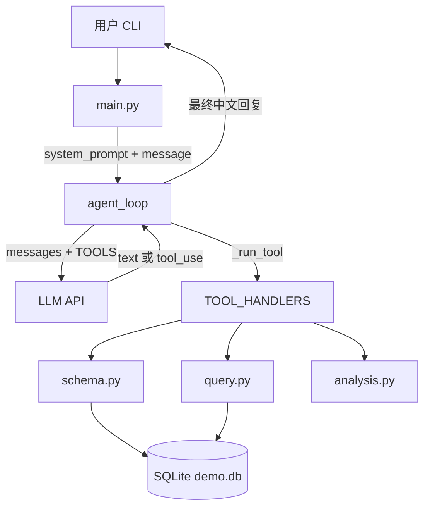

# 数据库助手 Agent

自然语言查询数据库的 AI Agent。基于 Claude API，用 Agent Loop 自主探索表结构、生成 SQL、分析结果。

## 架构

```
用户 (CLI)
    │
    ▼
┌─────────────┐     System Prompt      ┌──────────────────┐
│   main.py   │ ─────────────────────► │  LLM API         │
│ 注册 Tools  │                        │  (DeepSeek 等)   │
└──────┬──────┘                        └────────▲─────────┘
       │                                        │
       ▼                                        │ Think
┌─────────────┐   tools=TOOLS                   │
│  agent.py   │ ───────────────────────────────►│
│ Agent Loop  │◄────────────────────────────────┘
│ Observe→    │         tool_use / text
│ Think→Act   │
└──────┬──────┘
       │ Act: TOOL_HANDLERS[name]
       ▼
┌─────────────────────────────────────────┐
│ tools/                                  │
│  schema.py   list_tables / describe     │
│  query.py    run_query (只读 SELECT)    │
│  analysis.py analyze_results            │
└──────────────────┬──────────────────────┘
                   ▼
            ┌─────────────┐
            │ SQLite DB   │
            │ db/demo.db  │
            └─────────────┘
```



## 技术栈

- Python 3.12, asyncio
- Claude API (Anthropic SDK) + Tool Use
- SQLite
- 自研 Agent Loop（不依赖 LangChain）

## 快速开始

```bash
uv sync
uv run python db/seed.py    # 初始化示例数据
uv run python main.py        # 启动 Agent
```

## 设计决策

- **为什么不用 LangChain？** 第一阶段先理解底层循环。Phase 4 会引入 LangGraph 做多 Agent 编排。
- **为什么只允许 SELECT？** 安全考量。写操作留到后续版本加审批流程。
- **为什么用 SQLite？** 零配置，demo 方便。生产环境可换 PostgreSQL（改连接串即可）。

## 示例

```
你: 上周每个部门的销售额排名？
Agent: 让我先看看有哪些表...
      [list_tables → describe_table → run_query]
      上周销售排名：1. 销售部 ¥383,000  2. 市场部 ¥180,000...
```