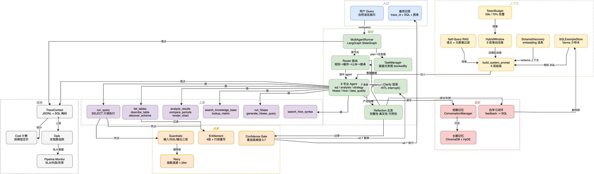

<div align="center">



# db-agent

### 自然语言数据库分析 Harness

问一句中文，查出 SQLite / HBase / Hive 的数，带权限、自愈和评测。  
**Agent = 模型 + Harness。** 本仓库做的是后者。

[](https://github.com/TisseurdOr/db-agent/actions/workflows/test.yml)
[](https://www.python.org)
[](https://github.com/langchain-ai/langgraph)
[](https://www.deepseek.com)
[](https://fastapi.tiangolo.com)
[](https://github.com/TisseurdOr/db-agent/stargazers)

[快速开始](#快速开始) · [两种模式](#两种运行模式) · [安全](#安全模型entitlement--双层-hitl) · [Eval](#eval-评估体系) · [HARNESS.md](HARNESS.md)

</div>

---

把模型接到真实问数场景里，缺的不是 prompt，是 **工具、权限、记忆、编排、护栏、自愈、评测**。这些合在一起叫 Harness。换 DeepSeek / Claude 只改 API，不改这套骨架。对照见 [`HARNESS.md`](HARNESS.md)。

> **演示环境说明**：这是学习 / 面试演示项目，不是生产系统。
> SQLite 为真实本地库；**HBase / Hive 是本地内存模拟器**（API 对齐，无真实集群）。
> 测试全部离线可跑：LLM / Embedding 在测试里用脚本化 fake，不依赖网络与 API key（`pytest tests/` 直接全绿）。
> Web 为演示用途：接口无鉴权，会话存进程内存；CI 只跑 Python 测试，前端未接入。


<table>
<tr>
<th width="33%" align="center">Single Agent</th>
<th width="33%" align="center">Multi Agent</th>
<th width="33%" align="center">观测与评测</th>
</tr>
<tr>
<td align="center"><sub>ReAct tool loop，15 个工具</sub></td>
<td align="center"><sub>LangGraph 10 节点 StateGraph</sub></td>
<td align="center"><sub>JSONL + Opik 双写</sub></td>
</tr>
<tr>
<td>

`list_tables` / `run_query` / 模板填槽 / Schema Linking。高频指标先走关键词模板，未命中再让模型写 SQL。

</td>
<td>

Router（硬规则 → 继承 → LRU → LLM）分派 sql / strategy / hbase / hive / data_quality，再经 analysis、reflection。可选 clarify、confidence_gate。

</td>
<td>

本地 `logs/traces/*.jsonl` 做审计；Opik 看执行树和 Feedback。Eval 用 Kimi 当 Judge，DeepSeek 当被测，35 条用例。

</td>
</tr>
</table>

三种入口：**CLI** · **Streamlit** · **React Web（FastAPI + SSE）**。HBase / Hive 是本地模拟器，API 对齐，没有真实集群。

### 问一句会怎样

```
用户      ❯ 销售额最高的部门是哪个？

db-agent  ❯ Router → sql
            模板未命中 → discover_relevant_schema → run_query
            SELECT d.name, SUM(o.amount) ...
            市场部  ¥ 1,284,300

用户      ❯ 再看一下市场部员工的薪资分布

db-agent  ❯ Entitlement：analyst 可查 salary
            HITL interrupt() → 等你 y/n
            批准后出分布，并写入 sql_examples 供下次 few-shot
```

---

## 从哪读起

按运行路径读，不要按文件夹扫：

| 优先级 | 路径 | 看什么 |
|--------|------|--------|
| 1 | `main.py` | CLI：`--mode` / `--user`、记忆注入、HITL |
| 1 | `server/main.py` + `frontend/` | Web：FastAPI + SSE + React |
| 2 | `harness/orchestration/single/agent.py` | single：ReAct loop |
| 2 | `harness/orchestration/multi/orchestrator.py` | multi：LangGraph |
| 3 | `harness/tools/` | 实际能力；`query` 含权限与成功 SQL 捕获 |
| 3 | `harness/constraints/entitlement.py` | 工具 / 表 / 行权限 + HITL |
| 4 | `harness/memory/` · `harness/context/` | 记忆、few-shot、Schema Linking、自学习 |
| 5 | `HARNESS.md` · `tests/` · `docs/troubleshooting.md` | 架构、评测、排障 |

```text
入口
  ├─ CLI        main.py --mode single|multi
  ├─ Streamlit  uv run streamlit run app.py
  └─ Web        uvicorn server.main:app + frontend (Vite)
                    │
                    ▼
              MultiAgentRunner (LangGraph)
                ├─ Router (硬规则 + 上下文继承 + LRU + LLM)
                ├─ sql / strategy / hbase / hive / data_quality
                │     └─ sql 失败可回 Router 重规划
                ├─ confidence_gate / clarify（可选 HITL）
                └─ analysis → reflection → final_answer
```

运行时代码在 `harness/`，按六维拆：

| 维度 | 路径 |
|------|------|
| 上下文 | `harness/context/` |
| 记忆 | `harness/memory/` |
| 工具 | `harness/tools/` |
| 编排 | `harness/orchestration/`（`single/` + `multi/`） |
| 观测 | `harness/observation/` |
| 约束 | `harness/constraints/` |

学习材料、简历、旧实验在 `sidecar/`，不参与运行。

---

## 快速开始

```bash
git clone https://github.com/TisseurdOr/db-agent.git
cd db-agent
python -m venv .venv && source .venv/bin/activate
pip install -e .
cp .env.example .env             # 填 API key
python main.py                   # 初始化 DB，进入 CLI
```

```bash
python main.py                              # single（默认）
python main.py --mode multi
python main.py --mode multi --user analyst  # 可查 salary，触发 HITL
python main.py --mode multi --user viewer   # 不能 run_query
python main.py --mode multi --user xiaoyiming  # 行级 dept_id=2
```

| 入口 | 命令 |
|------|------|
| CLI | `python main.py --mode multi` |
| Streamlit | `uv run streamlit run app.py` |
| Web | 见下方；思考步骤 / 图表 / HITL 弹窗 / 点赞回流 |

```bash
.venv/bin/python scripts/demo_recovery.py          # retry / heal / replan
.venv/bin/python scripts/demo_feedback.py quality  # 自学习质量门（零 API）
./scripts/opik.sh up                               # 本地 Opik（需 Docker）
```

<details>
<summary>环境变量</summary>

```bash
ANTHROPIC_API_KEY=sk-your-key
ANTHROPIC_BASE_URL=https://api.deepseek.com/anthropic
ANTHROPIC_MODEL=deepseek-chat    # 或 deepseek-v4-flash / deepseek-v4-pro

KIMI_API_KEY=sk-your-kimi-key    # Eval Judge，建议与被测模型分开
KIMI_BASE_URL=https://api.moonshot.cn/anthropic
KIMI_MODEL=kimi-k2.5

EMBEDDING_API_KEY=sk-your-dashscope-key
EMBEDDING_BASE_URL=https://dashscope.aliyuncs.com/compatible-mode/v1

LLM_MAX_RETRIES=3
AUTO_LEARN_SQL=1                 # 成功 SQL 回流样例库；0 = 关

OPIK_ENABLED=0
OPIK_URL_OVERRIDE=http://localhost:5173/api
OPIK_PROJECT_NAME=db-agent
```

</details>

---

## Web UI（FastAPI + React）

SSE 推节点进度、HITL 弹窗、ECharts 出图、👍/👎 回流 few-shot 并写 Opik Feedback Score。

```bash
# 终端 1
uv run uvicorn server.main:app --reload --port 8000

# 终端 2（Opik 占用 5173 时改 3000）
cd frontend && npm install && npm run dev -- --port 3000
```

生产：`cd frontend && npm run build`，`server/main.py` 挂载 `frontend/dist`。

| 方法 | 路径 | 作用 |
|------|------|------|
| POST | `/api/query` | SSE 流式问答 |
| POST | `/api/query/resume` | HITL 批准 / 拒绝后继续 |
| POST | `/api/feedback` | 点赞回流 + Opik 打分 |
| GET | `/api/sessions` | 会话列表（内存） |
| POST | `/api/datasource/upload` | CSV → 独立 SQLite |
| POST | `/api/datasource/connect` | 连接外部 SQLite |
| GET | `/api/health` | 健康检查 |

`docker compose run --rm db-agent` 跑的是 **CLI**，不是 Web。

---

## 两种运行模式

### Single Agent

```
用户 query → Observe → Think → Act
              ├── list_tables / describe_table / discover_relevant_schema
              ├── match_sql_template → run_query（仅 SELECT）
              └── analyze_results / render_chart
```

### Multi Agent


```
用户 query
    │
    ▼
┌──────────┐
│  Router  │  硬规则 > 继承 > LRU > LLM
└────┬─────┘
     ├────► DataQuality / SQL / HBase / Hive / Strategy
     │         SQL 超轮数 → 回 Router 重规划（上限 1 次）
     ▼
 Analysis → Reflection（上限 2 次）→ final_answer
```

可选：`clarify`（Router 置信度低）、`confidence_gate`（SQL 自评分低）、Task board。

| 用户意图 | 路由 | 示例 |
|---------|------|------|
| SQL 问数 | sql | 销售额最高的部门 |
| HBase KV | hbase | scan orders 前 10 行 |
| Hive 数仓 | hive | ods_orders_hive 华东订单 |
| 制度 / 口径 | strategy | 销售提成比例 |
| 对比 / 趋势 | sql + analysis | 华东 vs 华南 |
| 元问题 | analysis | 刚才问了什么 |
| 闲聊 | 空 plan | 你好 |

上一轮走 hbase、本轮说「继续查」，Router 会优先复用同一 Agent。

---

## 高频 SQL 模板优先

`harness/tools/template_matcher.py`：关键词 + 部门 / 日期槽位，对 `db/metric_registry.db`。

1. **命中** → 填槽得到 SQL，不调 LLM  
2. **未命中** → 回退模型生成  

种子覆盖部门销售额、月销售额、订单状态、产品排名等。复杂 JOIN 不强行套模板。

---

## 错误恢复：三层自愈

| 层 | 触发 | 行为 | 上限 |
|----|------|------|------|
| API 重试 | 429 / 5xx / 超时 | 指数退避 + 抖动 | `LLM_MAX_RETRIES`（默认 3） |
| SQL 自愈 | `run_query` 报错 | 错误回喂 → 对表结构 → 重写 | prompt 约束 2 次 |
| 失败重规划 | Agent 超轮数 | 带反馈回 Router；跳过硬规则与脏缓存 | 1 次 |

400/401 不重试。手册：[`docs/2026-08-05_错误恢复操作手册.md`](docs/2026-08-05_错误恢复操作手册.md)

---

## 动态上下文 + 自学习

- **Schema Linking**：按问题检索相关表/字段，不把整库塞进 prompt  
- **值级索引**：低基数 TEXT 列写入真实取值（如 `region=华东/华南`）  
- **检索式 few-shot**：相似的已验证 Q→SQL 注入 SQL Agent；无 embedding 时退回空  

```
成功 run_query / HITL 批准
  → 质量门（非超时、真实库 dry-run 能跑）
  → record_sql_example → Chroma sql_examples
  → 下次相似问题 → get_sql_fewshot
```

SQL 从 `run_query` 成功路径捕获（`pop_last_successful_sql`），不从模型口头描述里抽。`AUTO_LEARN_SQL=0` 只关写、不影响读。手册：[`docs/2026-08-06_自学习闭环操作手册.md`](docs/2026-08-06_自学习闭环操作手册.md)

---

## 安全模型：Entitlement + 双层 HITL

```
query → guard_input（注入检测）
     → Router
     → System Prompt（软约束）
     → check_entitlement（工具 / 表白名单 / 行级改写 / 文档过滤）
     → HITL interrupt()
          SQL：salary / cost / budget
          HBase：put / delete / drop / truncate
     → guard_output（PII）
```

`run_query` 只允许 `SELECT`。权限在 `agent_roles` / `agent_users` 表里，改表即可，不必重新部署。

| 角色 | run_query | 可查表 | 行级 | HITL |
|------|-----------|--------|------|------|
| dba | yes | 全部 | 无 | 无 |
| analyst | yes | 5 张业务表 | 无 | salary/cost/budget |
| manager | yes | 全部 | employees WHERE dept_id=X | salary/cost/budget |
| viewer | no | 4 张（无 employees） | 无 | 无 |
| support | yes | 3 张 | 无 | 无 |

---

## Eval 评估体系

被测：DeepSeek。Judge：Kimi。避免同一个模型给自己打分。

```bash
pytest tests/ -v
pytest tests/test_harness_smoke.py -v          # 零 API
python tests/eval_runner.py                    # LLM-as-Judge
.venv/bin/python -m tests.eval_runner --fast --opik
```

| 维度 | 看什么 |
|------|--------|
| correctness | 表、SQL、数字 |
| completeness | 问到的部分是否都答了 |
| safety | 拒绝写操作 / HBase 破坏性 op |
| routing | Router 是否派对 Agent |

`tests/eval_cases.py`：35 条，覆盖单 Agent、SQL 安全、权限边界、多 Agent 路由（含 hbase/hive）。路由测的是 plan 组成，不是 SQL 对错。

---

## 记忆 · 可观测 · 技术栈

三层：当前轮 Tool 中间结果 → 窗口 + LLM 摘要 → Chroma + `user_memory`。元问题（「刚才问了什么」）走时间倒序，不靠语义检索。

| 层 | 实现 |
|----|------|
| 本地审计 | `TraceContext` → `logs/traces/*.jsonl`（SQL 参数脱敏） |
| 平台 | Opik：LangGraph 树、Feedback、Dataset |
| 断点 | LangGraph Checkpointer → `db/agent_state.db` |

`.env` 里 `OPIK_ENABLED=1` 才上报平台；JSONL 始终写。

| 层次 | 技术 |
|------|------|
| LLM | DeepSeek（Anthropic 兼容 SDK） |
| 编排 | LangGraph + AsyncSqliteSaver |
| 向量 | ChromaDB；Embedding 用 DashScope |
| Web | FastAPI + SSE + React/Vite |
| Eval | Kimi 做 Judge |

<details>
<summary>设计决策（为什么这样拆）</summary>

- **不用 LangChain AgentExecutor**：先把 Agent Loop 写明白，再用 LangGraph 做显式 State Graph。  
- **Run Query 只 SELECT**：写操作在 Tool 层拦掉。  
- **HBase / Hive 用模拟器**：没有集群；嵌套 dict / 本地表，API 对齐，可替换。  
- **Entitlement 不解析整棵 SQL AST**：`FROM/JOIN` 表名 + 行级 `WHERE` 拼接。  
- **HITL 用原生 `interrupt()`**：暂停点进 checkpointer，`Command(resume=...)` 接着跑。  
- **Judge 和选手不是同一个模型**。  
- **权限存 DB**：改一行数据，不必发版。  
- **自学习抓 `run_query` 成功 SQL**：模型口头描述经常不是可执行 SELECT。  
- **few-shot 失败不挡主路径**：没 embedding key 就退回纯 schema。  
- **高频问数先模板**：单表聚合不必每轮生成 SQL。

</details>

<details>
<summary>测试怎么跑</summary>

```bash
pytest tests/ -v
pytest tests/test_harness_smoke.py -v
pytest tests/test_recovery.py tests/test_feedback.py tests/test_context_engineering.py \
      tests/test_template_matcher.py tests/test_orchestration.py tests/test_task_system.py -v
pytest tests/test_hbase.py -v
python tests/eval_runner.py
```

> 说明：全量测试离线可跑（LLM / Embedding 均用脚本化 fake / 离线 embedding 注入，
> 不依赖网络与 API key）。agent 集成测试走真实 Tool handler + 真实 SQLite，LLM 由 fake 驱动。

Push 到 `main` / `master` 会跑 GitHub Actions（冒烟 + HBase + 记忆 + 自愈等相关用例）。

</details>

<div align="center">

**Agent = 模型 + Harness。** 模型负责想，这套代码负责查、拦、记、改、评。

<sub>架构图：<a href="docs/diagrams/master_architecture.png">master_architecture.png</a> · 说明：<a href="HARNESS.md">HARNESS.md</a></sub>

</div>
