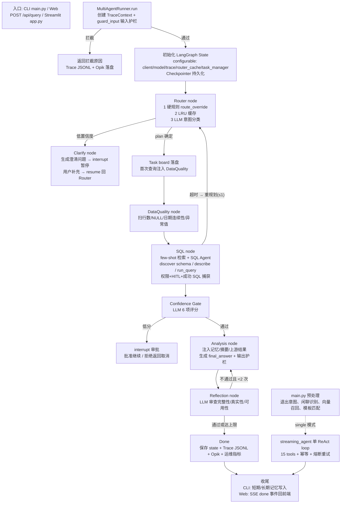
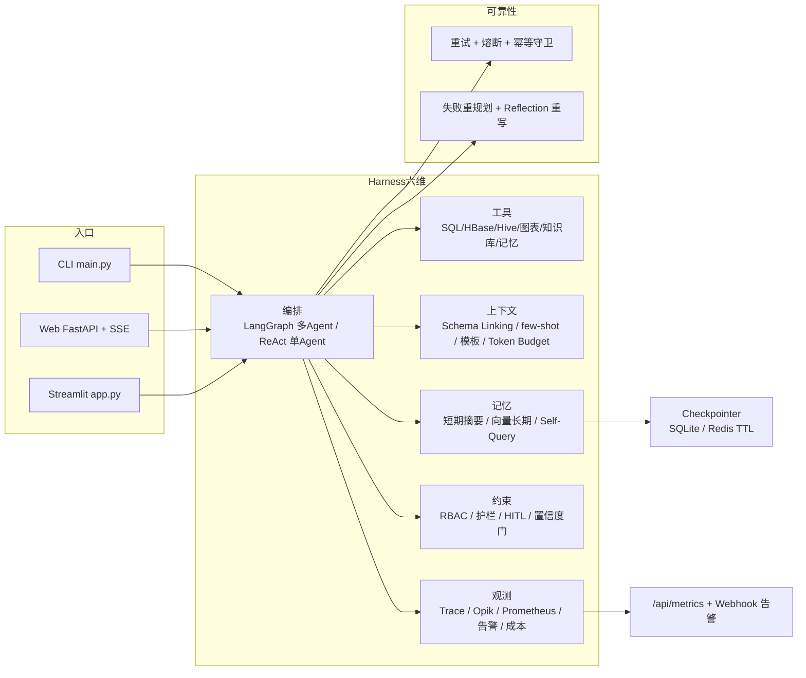
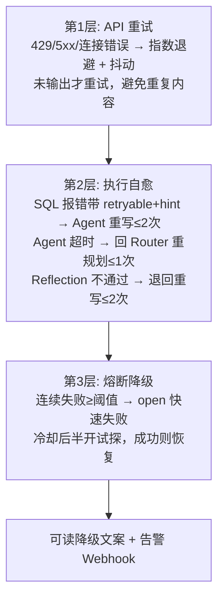
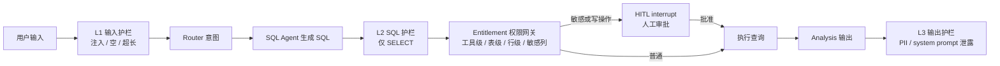
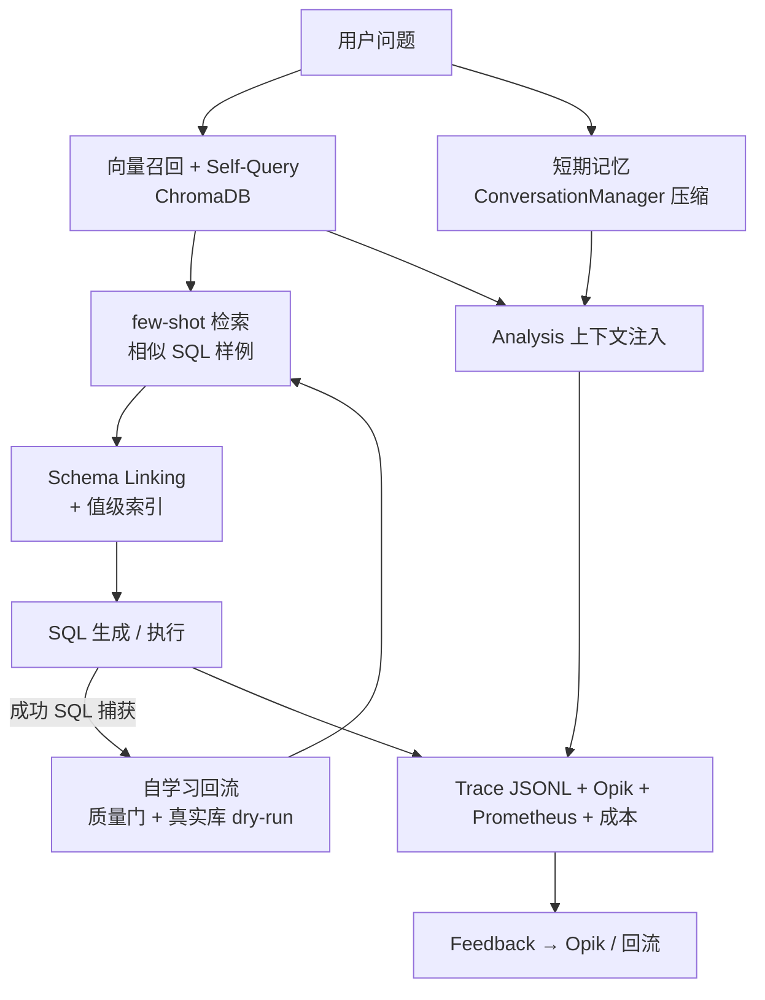

# db-agent 工程机制图解

本文档保存「一条 query 的完整链路」和「工程机制评估」中用到的所有流程图。图使用 Mermaid 编写：

- GitHub 网页 / VS Code 的 Mermaid 插件可直接渲染；
- 也可以把代码块内容粘贴到 [mermaid.live](https://mermaid.live) 查看。

---

## 1. Query 完整链路图

### 分步说明

1. **入口层**：CLI 收输入；Web 起 SSE 流并先发 `preprocessing` 事件。
2. **输入预处理**：CLI 先判退出意图，再识别闲聊/元问题；正常问题做向量召回（相似度 >= 0.3 才注入），同时跑 SQL 模板匹配。模板命中只影响 single 的 prompt。
3. **输入护栏**：`guard_input` 拦截注入/空输入/超长，零 token 成本；被拦直接返回并落 trace。
4. **执行环境初始化**：创建 `TraceContext`，把 client/model/trace/router_cache/task_manager 放进 `configurable`，初始化 `state`。
5. **Router 意图分派**：硬规则 → LRU 缓存 → LLM。LLM 路径把最近 6 条消息一起发给 `ROUTER_PROMPT`，返回 JSON plan；解析失败兜底 sql。
6. **Clarify（可选）**：plan 带 `confidence=low` 时，LLM 生成澄清问题，`interrupt` 暂停等用户；resume 后用澄清后的 query 重新路由。
7. **Task board + DQ 注入**：plan 落盘成 `.tasks/` 任务图；首次查询且开启 DQ 时，在 plan 最前面插入 `data_quality`。
8. **DataQuality（可选）**：扫表行数、NULL 比例、日期连续性、异常值，只报告事实。
9. **SQL Agent 查询**：清残留 SQL、做 few-shot 检索；Agent 内部循环调 `discover_relevant_schema / describe_table / run_query`。`run_query` 过权限网关，敏感列触发 HITL，成功 SQL 被工具层捕获用于自学习；超时触发一次重规划。
10. **Confidence Gate**：LLM 按 6 项标准给 SQL 打分，低于 0.7 就 `interrupt` 让用户审批；拒绝则返回取消文案。
11. **Analysis**：把早期摘要、向量记忆、最近对话、Reflection 反馈、上游结果按层拼进 context，生成 `final_answer`，再做 `guard_output`。
12. **Reflection**：LLM 审查完整性/真实性/可用性；不通过且未到 2 次，把改进建议写回 `results["_reflection_feedback"]` 退回 Analysis 重写。
13. **Done / 返回**：`edge_router` 读到 `next=done` 结束；runner 保存 state、写 Trace JSONL、Opik 打点、记运维指标，返回 `final_answer`。
14. **收尾**：CLI 把问答写入短期 ConversationManager 和长期 VectorMemory；Web 把 `done` 事件（含 SQL、plan、图表、token）推给前端。

### 示例 walkthrough

以「对比华东和华南上季度的保费增速」为例：

- 输入护栏通过，进入 Router；
- 硬规则里 `对比` 存在，但数据关键词表是 `订单/销售/员工/数据/部门/产品`，没有「保费」，所以 `route_override` 返回 `None`，走 LLM 路由；
- LLM 大概率给出 `[sql, analysis]`；若开启 DQ 且是首轮，plan 变成 `[data_quality, sql, analysis]`；
- SQL Agent 先 schema discovery，再生成按 region + 上季度计算增速的 SQL；当前 demo 库没有保费表，所以真实结果会是「未找到保费相关表」，链路本身照常走完；
- 若 SQL 生成出来，过置信度门，Analysis 给「华东 vs 华南」增速对比结论，Reflection 检查后返回。

### single 模式差异

single 不经过 Router / DQ / Confidence Gate / Analysis / Reflection，入口预处理后直接进 `streaming_agent` 的单 ReAct loop：15 个 tools 全挂，模型自己决定调哪些工具，工具执行带幂等守卫和熔断重试。HITL 在 single 里退化为 `run_query` 返回「需要审批」标记，没有原生 interrupt 暂停/恢复。

---

## 2. 工程机制全景

### 说明

- 三种入口共用同一套 Harness；
- 运行时代码按六维组织：上下文、记忆、工具、编排、观测、约束；
- 可靠性能力（重试/熔断/幂等/重规划/Reflection）横切在编排和工具调用上；
- Checkpointer 支持 SQLite 和 Redis（带 TTL），Redis 不可用时自动降级回 SQLite。

---

## 3. 三层自愈

### 说明

- 第 1 层只重试可恢复错误（429/5xx/连接类），且只在「未输出任何内容」时重试，避免重复输出；
- 第 2 层覆盖 SQL 报错自愈、Agent 超时重规划、Reflection 重写，均有次数上限防死循环；
- 第 3 层熔断连续失败达到阈值后快速失败，冷却期后半开试探，打开时发告警；
- 幂等守卫（`run_tool_with_guard`）防止重试/重规划导致写工具重复执行。

---

## 4. 安全与权限链路

### 说明

- 三层护栏：输入（注入/空/超长）→ SQL（仅 SELECT）→ 输出（PII / system prompt 泄露）；
- Entitlement 权限网关做工具级 / 表级 / 行级 / 敏感列控制，权限数据存 DB，改表即生效；
- 敏感列查询和 HBase 写操作通过 LangGraph 原生 `interrupt()` 暂停，人工批准后 `resume()` 恢复；
- Web API 还有 `WEB_API_TOKEN` 可选鉴权，`/api/health` 保持开放供探针。

---

## 5. 记忆、上下文与观测闭环

### 说明

- 短期记忆由 ConversationManager 做滑动窗口 + 摘要压缩；长期记忆用 ChromaDB 向量召回；
- Self-Query 先拆查询意图再过滤元数据，检索失败自动降级；
- Schema Linking + 值级索引让模型直接使用真实枚举值，few-shot 命中相似 SQL 样例；
- 自学习回流从工具层捕获「真正执行成功的 SQL」，经过质量门 + 真实库 dry-run 才写回样例库；
- 观测层四件套：JSONL 审计（SQL 脱敏）、Opik Trace/Feedback、Prometheus `/api/metrics`、Webhook 告警。

---

## 6. 机制评分表

| 维度 | 分 | 主要加分点 | 主要扣分点 |
|---|---|---|---|
| 编排与状态 | 9 | LangGraph 条件边清晰；SQLite/Redis Checkpointer；Router 硬规则 > 缓存 > LLM | 节点仍偏长；plan 执行进度靠 `results` 的 key 隐式判断 |
| 自愈与容错 | 9 | 重试/自愈/重规划/Reflection/熔断/幂等齐全 | SQL 自愈预算靠 prompt；熔断状态不跨实例 |
| 安全与权限 | 8 | RBAC + 三层护栏 + HITL + Web Token | SQL 非 AST 解析；行级改写只覆盖简单 SQL |
| 记忆与上下文 | 8 | 三层记忆 + few-shot + 值级索引 + 模板优先 | 召回阈值写死；记忆无过期策略；模板只影响 single |
| 可观测与运维 | 8 | Trace/Opik/Prometheus/告警/成本/Task board | 打点分散；Trace 缺 model 字段 |
| 测试与 CI | 8 | 零 API 成本分层测试覆盖编排/权限/SSE/HITL | Eval 断言偏文案；无并发与压测 |
| 部署与工程化 | 7 | Docker Compose；Redis Checkpointer；TTL 回收；健康检查 | HBase 内存模拟不持久；无真实库迁移；无 k8s manifests |
| 代码质量 | 7.5 | 已拆 nodes/graph/runner/helpers；类型化 state/config | 全局单例偏多；部分失败静默降级难察觉 |

**综合：约 8 / 10。** 最像生产的地方是容错链路和可观测；最不像生产的地方是 SQL 安全精度、真实数据源接入和部署形态。

---

## 7. 对应代码文件

| 机制 | 代码位置 |
|---|---|
| 入口 | `main.py`、`app.py`、`server/main.py`、`server/endpoints/query.py` |
| 多 Agent 编排 | `harness/orchestration/multi/graph.py`、`runner.py`、`nodes.py`、`helpers.py` |
| 单 Agent | `harness/orchestration/single/agent.py`、`tools_bundle.py` |
| 三层自愈 | `harness/constraints/retry.py`、`circuit_breaker.py`、`idempotency.py` |
| 安全与权限 | `harness/constraints/entitlement.py`、`guardrails.py`、`confidence.py` |
| 记忆与上下文 | `harness/memory/`、`harness/context/` |
| 观测与运维 | `harness/observation/tracer.py`、`opik_tracing.py`、`ops_metrics.py`、`alerts.py`、`cost.py` |
| Checkpointer | `harness/orchestration/multi/runner.py`（SQLite / Redis） |
