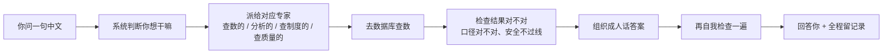

# db-agent 一页说明（给 BA / 非技术同事）

## 一句话

**db-agent 是一个“会说中文的数据库助手”：你问它一句人话，它去数据库里查数据，再用人话回答你，而且保证不乱改数据、敏感信息要审批、出错会自动重试。**

## 打个比方

以前业务要查数，流程是：

> 业务提需求 → 数据分析师排期 → 写 SQL → 校验 → 出报表 → 业务等几周

db-agent 想做的是：

> 业务直接问一句中文 → 助手自己查 → 自己分析 → 马上回答

它相当于一个 **“懂数据库的翻译 + 质检员 + 安全员”**：

- 翻译：把“上个月华东卖了多少”翻译成数据库能懂的语言
- 质检员：查完还要检查答案对不对、口径对不对
- 安全员：敏感数据不能随便看，改数据的操作必须有人批准

## 这个项目做了什么

| 能力 | 用大白话说 |
|---|---|
| 中文问数 | 不懂 SQL 也能查：销售额、订单数、部门对比、趋势 |
| 多种数据源 | 能查三类数据：普通业务库、数据仓库（Hive）、KV 数据库（HBase） |
| 懂业务口径 | 知道“销量”是按已支付算还是含退款算，口径不会乱 |
| 权限控制 | 不同角色看到不同数据；敏感字段（工资、成本、预算）要审批 |
| 人工审批 | 高风险操作会停下来等人类确认，不会偷偷改数据 |
| 自动纠错 | 查错了会自己改 SQL 重试，不会甩锅 |
| 过程可查 | 每一步都记录，出问题能追溯 |
| 结果可评 | 有一批测试问题验证它答得对不对 |

## 它怎么做（业务视角）

中间有一个重要的环节：**需要审批时会停下来问你**。比如“查一下员工工资”，系统会弹出来问：确认要查吗？你同意才继续。

## 它有什么价值

- **省时间**：不用等数据组排期，常见问题马上有答案
- **口径统一**：同一个指标，大家查到的口径一致，不会再扯皮
- **安全可控**：谁能看什么、什么操作要审批，都有规则
- **可追溯**：答了什么、查了什么、怎么查的，都能查记录

## 边界（要诚实说明）

- 已上线，但规模尚小；数据源为本地模拟数据，尚未接入公司真实系统
- Hive、HBase 是**模拟器**，不是真实集群
- 如果要接真实数据，需要替换连接器并做权限配置
- 大模型和向量服务走外部 API，**敏感数据出域需要合规评估**

## 一句话总结

> db-agent 不是让模型写 SQL，而是让模型写 SQL 不出事：说人话、查得准、管得住、错了会改、过程可查。
