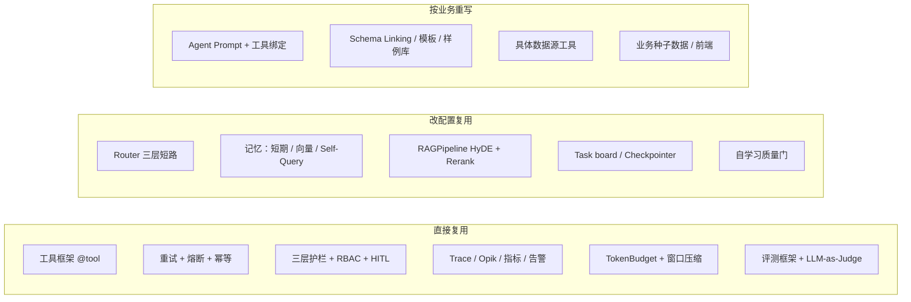

# 把 Agent 工程拆成积木：db-agent 复盘与可复用模块库

> 适合读者：正在做/准备做 Agent 应用的人。
> 核心结论：Agent 工程不是从零搭，而是“选积木 + 接管线 + 配规则”。本文复盘 db-agent，给出可以直接复用、改配置复用、按业务重写的三层模块清单。

## 一、复盘结论

db-agent 是一个自然语言数据库分析 Agent。它真正沉淀下来的，不是“会用 LangGraph”，而是一套**可移植的 Agent 工程模块**：

- 确定性优先：规则 > 缓存 > LLM
- 所有循环都有预算：重试/重写/重规划都设上限
- 能力可降级：增强组件挂了，主流程不挂
- 质量门前置：写库、回流、发布都先校验
- 评测驱动改动：先量化，再优化，改完跑回归

## 二、拼图式模块库总览

## 三、模块复用度总表

| 模块 | 复用度 | 说明 |
|---|---|---|
| `@tool` 工具框架 | 直接用 | 函数签名自动生成 schema，新 Agent 直接挂 |
| 重试/熔断/幂等 | 直接用 | 全局 LLM 调用 + 写工具去重，零业务耦合 |
| 三层护栏 | 直接用 | 规则可配置，输入/SQL/输出各管一段 |
| RBAC + HITL | 直接用 | 表结构可复用，角色/权限按业务配 |
| Trace/Opik/指标/告警 | 直接用 | 换数据源配置即可 |
| TokenBudget + 窗口压缩 | 直接用 | 不依赖具体业务 |
| 评测框架 | 直接用 | 换用例集和 Judge 模型 |
| Router 三层短路 | 改配置 | 硬规则表换成新业务关键词 |
| 记忆系统 | 改配置 | Chroma/Milvus 后端可换，字段白名单可配 |
| HyDE + Rerank | 改配置 | 换模型/本地 reranker 即可 |
| Task board / Checkpointer | 改配置 | SQLite/Redis 可切 |
| 自学习质量门 | 改配置 | 换存储和校验函数 |
| Agent Prompt + 工具绑定 | 重写 | 每个 Agent 的职责/工具不同 |
| Schema Linking / 模板 / 样例库 | 重写 | 依赖业务库结构 |
| 具体数据源工具 | 重写 | run_query/HBase/Hive 换成你的数据源 |
| 业务种子数据 / 前端 | 重写 | 每项目不同 |

## 四、分模块复盘

### 1. 多 Agent 编排

**做了什么**：LangGraph StateGraph，Router → 专业 Agent → 质量闸 → Analysis → Reflection；Checkpointer 持久化；HITL interrupt/resume。

**可移植经验**：
- 循环必须有预算（Reflection ≤2、重规划 ≤1），防死循环烧钱。
- 状态外置到 Checkpointer，而不是进程内存，才能断点续跑和多实例。
- HITL 用框架原生暂停，比自建审批队列稳。

**坑**：单文件 1200 行，重构后测试 monkeypatch 失效过。结论：**先拆再改，拆完跑全量测试**。

### 2. Router 路由

**做了什么**：硬规则 → LRU 缓存 → LLM 三层短路；低置信度触发 Clarify。

**可移植经验**：
- 高频确定性请求零 LLM，省钱且可控。
- 缓存 key 要规范化（去标点/空格/小写）。
- LLM 兜底也要有兜底：JSON 解析失败回退 sql。

**坑**：正则规则维护成本高，必须配回归用例。

### 3. 工具系统

**做了什么**：`@tool` 自动生成 schema；结构化错误返回；工具结果截断；写工具幂等。

**可移植经验**：
- 工具契约自动生成，避免 schema 漂移。
- 失败是正常返回，喂回模型自愈。
- 有重试就必有幂等，尤其是写类工具。

**坑**：幂等白名单靠手维护，新写工具容易漏。

### 4. 安全与权限

**做了什么**：5 角色 RBAC（工具/表/行/敏感列），三层护栏，HITL。

**可移植经验**：
- 权限存数据，不存代码，改表即生效。
- 软约束不够，工具层硬拦截才是最后一道门。
- PII 出现不等于泄露，越权要在查询源头掐断。

**坑**：SQL 检查是正则不是 AST；行级改写只支持简单 SQL。生产换 sqlparse/sqlglot 或数据库原生权限。

### 5. 上下文与检索

**做了什么**：Schema Linking + 值级索引；few-shot + 模板优先；TokenBudget + 窗口压缩。

**可移植经验**：
- 让模型看到真实枚举值，而不是猜。
- 模板 > LLM，高频问题直接命中。
- 增强能力必须可降级，不能挡主流程。

**坑**：模板只挂了 single 模式；参数（阈值/水位）写死，应该可配置。

### 6. 记忆

**做了什么**：短期滑动窗口+摘要；ChromaDB 长期 + Self-Query；自学习回流。

**可移植经验**：
- 从工具层捕获事实，不从模型文本猜。
- 写库前过质量门，脏数据比没有更糟。
- HITL 批准的样本打“人工背书”标记，可信度更高。

**坑**：HyDE+Rerank 曾经只挂在评测里没接主链路；向量记忆无 TTL。

### 7. 观测与运维

**做了什么**：Trace JSONL（SQL 脱敏）+ Opik；Prometheus 指标；Webhook 告警；成本估算。

**可移植经验**：
- 审计日志先脱敏再落盘。
- 本地 JSONL + 平台双写：离线可查，在线可对比。
- 指标/告警在架构里，而不是事后补。

**坑**：Opik 打点分散；Trace 没存 model 字段；指标进程内重启清零。

### 8. 评测与测试

**做了什么**：零 API 冒烟/单元/集成分层；Eval + LLM-as-Judge；检索消融。

**可移植经验**：
- 测试按成本分层：便宜的常跑，贵的单独跑。
- Judge 和被测模型分开，避免自评偏差。
- 先消融再优化，知道每个组件贡献多少。

**坑**：断言偏文案；Golden Set 太小，需要持续补充。

### 9. 工程化

**做了什么**：CLI 产品化、启动配置校验、Docker + 锁文件、模块拆分、Redis 降级。

**可移植经验**：
- Fail fast：配置缺失启动就报错。
- 能降级就不崩：Redis 挂了回 SQLite。
- 重构保持 API 兼容：拆模块用 re-export。

**坑**：SQLite 并发锁、HBase 内存模拟、无备份迁移——demo 和生产要分清。

## 五、怎么拼一个新 Agent

### 示例 1：NL2SQL 分析 Agent
直接用：工具框架 + 三层护栏 + RBAC/HITL + Trace/Opik + 评测框架。
改配置：Router 规则、Schema Linking、few-shot 样例、记忆。
重写：业务表描述、指标口径、具体 SQL 工具。

### 示例 2：企业客服 Agent
直接用：重试/熔断/幂等 + 护栏 + 记忆 + 观测 + 评测。
改配置：Router 意图表、RAGPipeline、自学习质量门。
重写：知识库加载、工单/CRM 工具、前端会话。

### 示例 3：研报分析 Agent
直接用：编排骨架 + 工具框架 + 评测。
改配置：多 Agent 分工、检索策略、Trace/告警。
重写：研报解析工具、结构化提取、指标口径。

## 六、复用边界：哪些不能直接搬

- 业务语义（指标口径、制度文档）永远要重写
- 数据源连接（MySQL/HBase/Hive/API）按业务换
- Agent Prompt 不能照抄：职责边界跟着业务走
- 评测用例不能照抄：Golden Set 是业务的“验收标准”

## 七、写在最后

做 Agent 最大的进步，不是“会调 API”，而是**把 Agent 工程拆成可拼装的模块**。db-agent 证明了一件事：

> 工具、护栏、记忆、评测、观测这些“积木”是可以跨项目复用的；真正需要你重写的，只有业务语义和业务流程。

这也是我下一阶段的工程方法：**先搭积木库，再拼业务 Agent**。
